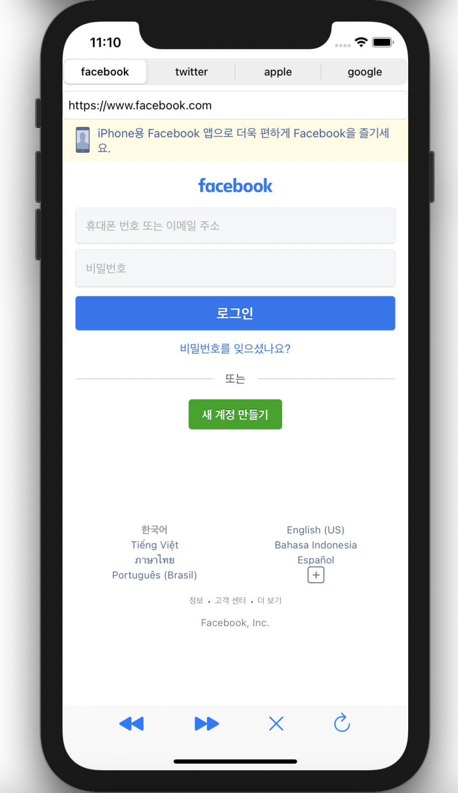

## 📒 섹션7 - 미니 브라우저

- `Segmented Control` 과 `WebView` 로 페이스북, 트위터, 애플, 구글 사이트에 접속하는 미니 브라우저 앱

- `toolBar` 로 웹사이트 뒤로가기, 앞으로가기, 새로고침, 취소 가능

### 📌 파일 구조


---

### 📌 실행 화면

<p align="center">
  
</p>


---

### 📌 강의 핵심

#### 🔍 WebView

- **URL load**

```swift
mainWebView.load(URLRequest(url: URL(string: urlString)!))
```

- **goBack, goForward, stopLoading, reload**

```swift
mainWebView.goBack()
mainWebView.goForward()
mainWebView.stopLoading()
mainWebView.reload()
```

- **`webView` 가 다 로드가 되면 `Activity Indicator View`  멈추게 하고 싶을 때**

  -  `WKNavigationDelegate` 채택

  ```swift
   func webView(_ webView: WKWebView, didFinish navigation: WKNavigation!) {
          spinningActivityIndicatorView.stopAnimating()
      }
      
      func webView(_ webView: WKWebView, didStartProvisionalNavigation navigation: WKNavigation!) {
          spinningActivityIndicatorView.startAnimating()
      }
  ```

  - `mainWebView.navigationDelegate = self`


#### 🔍 Toolbar 

- `BarButtonItem` 으로 요소 추가 가능
- `Flexible space` 로 공백 넣기 가능


