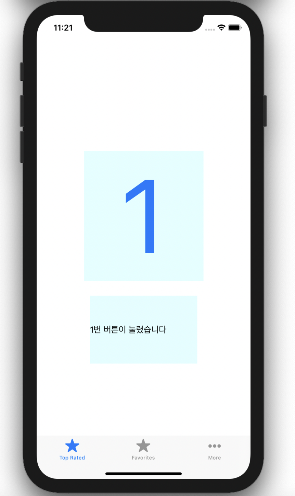
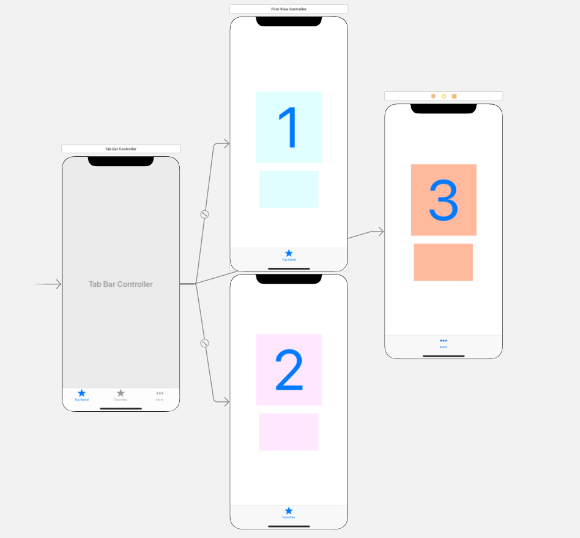

## 📒 섹션 10 - TabbarEX

- `TabbarViewController` 로 `tabBar` 를 구현하여 1,2,3 숫자를 보여주는 앱

### 📌 파일 구조

```bash
.
├── TabbarEX
│   ├── AppDelegate.swift
│   ├── Assets.xcassets
│   │   ├── AccentColor.colorset
│   │   │   └── Contents.json
│   │   ├── AppIcon.appiconset
│   │   │   └── Contents.json
│   │   └── Contents.json
│   ├── Base.lproj
│   │   ├── LaunchScreen.storyboard
│   │   └── Main.storyboard
│   ├── FirstViewController.swift
│   ├── Info.plist
│   ├── SceneDelegate.swift
│   ├── SecondViewController.swift
│   └── ThirdViewController.swift
```


---

### 📌 실행 화면

<p align ="center">
  
</p>


---

### 📌 강의 핵심

#### Tabbar

<p align ="center">
  
</p>

- 메뉴별로  `ViewController.swift` 파일 생성 후 `class` 지정 해줘야 한다

- `tabBarController` 에서 순서 변경 가능
- 메뉴 최대 5개까지 가능

